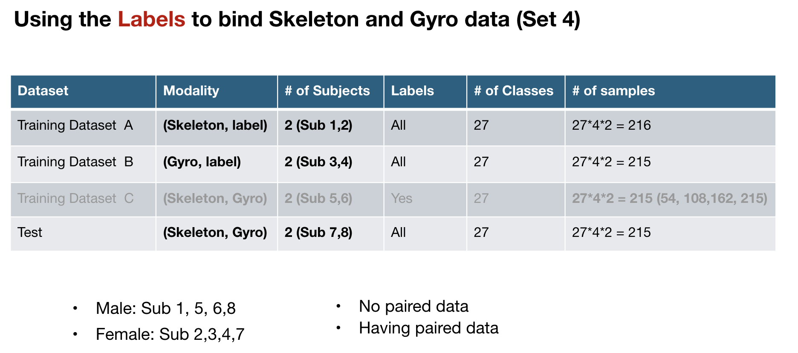

# MMBind - UTD Label Bind

**Update 0619**: update the file of "main_upper_bound.py" and "main_upper_bound_contrastive_supervise.py"

## Processed UTD dataset for label bind (data split is the same as sensor bind)
[https://drive.google.com/drive/folders/1gqVcOg5tagfdNNQ9d81oV0AReh--p_O1?usp=sharing](https://drive.google.com/file/d/136zY2L2krizCKf1MPEXY4AwJ09oylty4/view?usp=sharing)

## Data Split of UTD dataset

<p align="center" >
	
</p>


## No Paired Dataset (No train_C)
**main_mmbind_1_more_label_pair + mmbind_contarstive_supervise** has the best performance

#train_and_evaluate (train_A+train_B)
- Lower_bound: N/A as we did not add paired labeled data train_C
- **Baseline 1**: Unimodal supervised learning
		    ```bash
		    python3 main_baseline1_unimodal_supervise.py
		    ```
- **Baseline 2**: Incomplete multimodal supervised learning, no contrastive as no paired data
  		    ```bash
		    python3 main_baseline2_incomplete_multimodal.py
		    ```
- **Baseline 3**: Incomplete multimodal supervised learning + prompt
  		    ```bash
		    python3 main_baseline3_vector_attach_incomplete_multimodal.py
		    ```
- Baseline 4: N/A as we did not add paired labeled data train_C (Cross-modal generation)
- Baseline 5: N/A as we did not add paired labeled data train_C, (Dual contrastive)
- **Upper Bound** (all natually paired data from train_A and train_B): 
  * **(better)main_upper_bound_contrastive_supervise.py**: multimodal contarstive + supervised learning
    		    ```bash
		    python3  main_upper_bound_contrastive_supervise.py
		    ```
  * main_upper_bound.py: multimodal supervised learning

- **MMbind**:
  * Step 1: Pair data according to labels
     * **main_mmbind_1_more_label_pair**: generate as much as possible paired multimodal samples for each unimodal sample, e.g., N = N_A * N_B_i + N_B * N_A_i (N_B_i is the # of samples for class i)
      		    ```bash
		    python3  main_mmbind_1_more_label_pair.py
		    ```
    * (no need to run) main_mmbind_1_label_pair: only generate one paired multimodal sample for each unimodal sample, e.g., N = N_A + N_B
  * Step 2:
    * **MMbind_contarstive_supervise** (manually paired data by mmbind): multimodal contrastive learning + supervised learning (data of two paired modalities)
      		    ```bash
		    python3  main_mmbind_2_contarstive_supervise.py
		    ```
## Having Paired Dataset (Having train_C)
main_mmbind_1_more_label_pair + mmbind_contarstive_supervise has the best performance

#train (train_A+train_B)
- **Baseline 1**: Unimodal supervised learning 
- **Baseline 2**: Incomplete multimodal supervised learning, no contrastive as no paired data
- **Baseline 3**: Incomplete multimodal supervised learning + prompt
- **MMbind**:
  * Step 1: Pair data according to labels
       * (no need to run) main_mmbind_1_label_pair: only generate one paired multimodal sample for each unimodal sample, e.g., N = N_A + N_B
       * **main_mmbind_1_more_label_pair**: generate as much as possible paired multimodal samples for each unimodal sample, e.g., N = N_A * N_B_i + N_B * N_A_i (N_B_i is the # of samples for class i)
  * Step 2:
    * **MMbind_contarstive_supervise** (manually paired data by mmbind): multimodal contrastive learning + supervised learning (data of two paired modalities)

#evaluate (funetune an multimodal model with train_C)
- **Lower_bound**: multimodal supervised learning with train_C
- **Baseline 1**: multimodal supervised finetuning with train_C
- **Baseline 2**: multimodal supervised finetuning with train_C
- **Baseline 3**: multimodal supervised finetuning with train_C
- **Upper Bound** (all natually paired data from train_A+train_B+train_C): 
  * main_upper_bound.py: multimodal supervised learning
  * **(better)main_upper_bound_contrastive_supervise.py**: multimodal contarstive + supervised learning with train_C
- **MMbind_contarstive_supervise** (manually paired data by mmbind): multimodal contrastive learning + supervised learning with train_C

